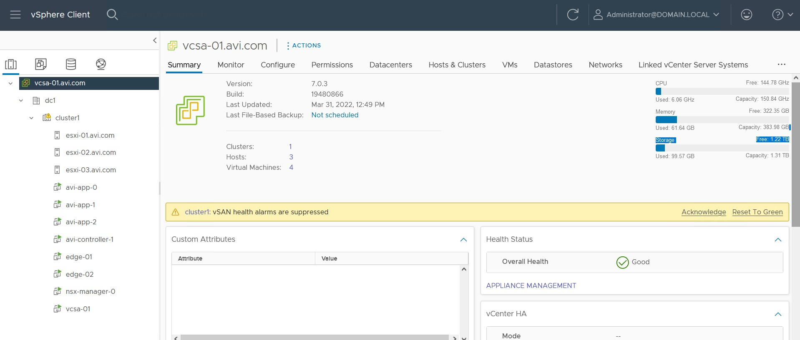
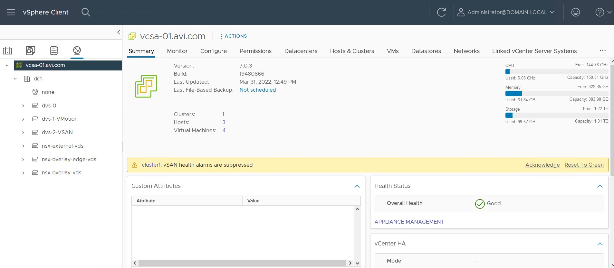
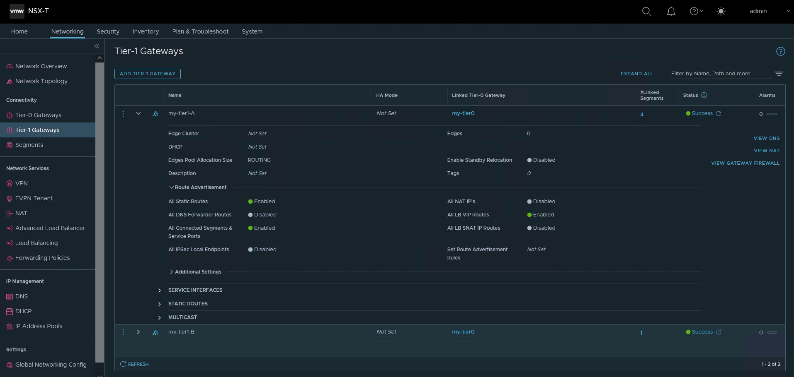
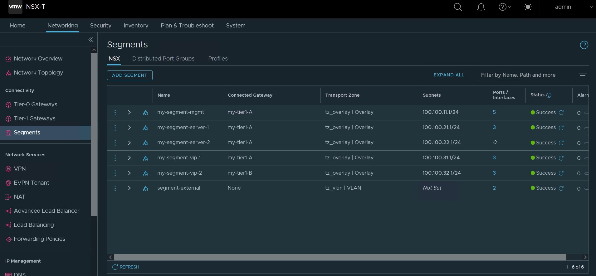
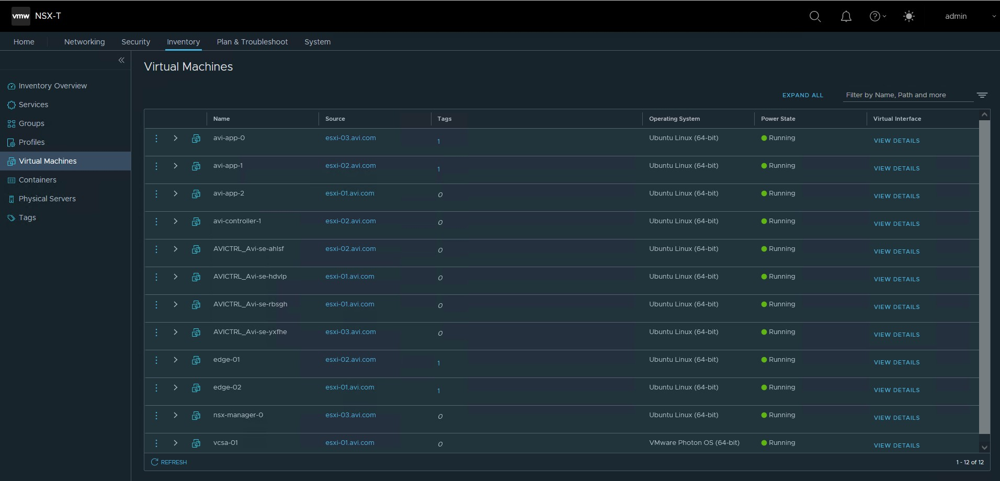
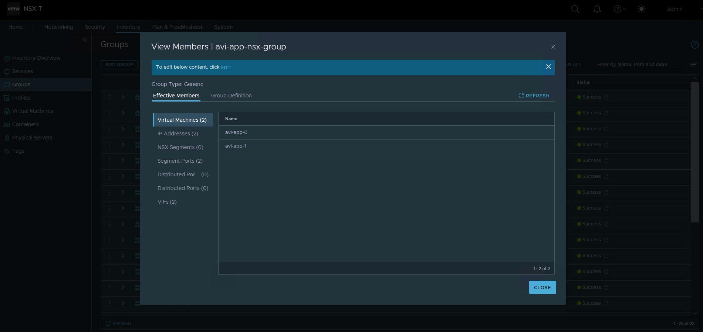
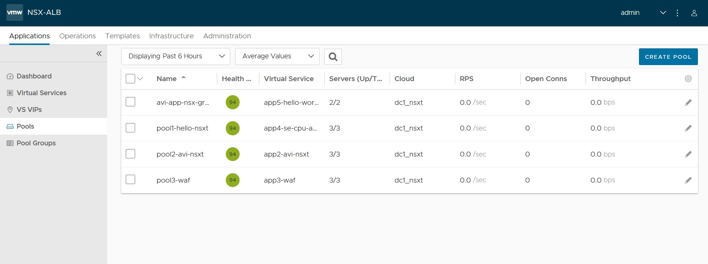
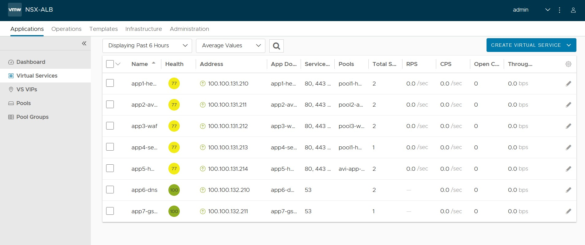

# tfNestedVsphere7NsxAvi

## Goal

This Infrastructure as code will deploy a nested ESXi/vCenter/NSX/Avi (on the top of vCenter environment which does not support 802.1q or vlan tagged).

## variables

### non sensitive variables

All the non-sensitive variables are stored in variables.json

### sensitive variables

All the sensitive variables are stored in environment variables as below:

```bash
export TF_VAR_esxi_root_password=******              # Nested ESXi root password
export TF_VAR_vsphere_username=******                # Underlay vCenter username
export TF_VAR_vsphere_password=******                # Underlay vCenter password
export TF_VAR_bind_password=******                   # Bind password
export TF_VAR_ubuntu_password=******                 # Ubuntu password for dns-ntp and external gw VMs
export TF_VAR_vcenter_password=******                # Overlay vCenter admin password
export TF_VAR_nsx_password=******                    # NSX admin password
export TF_VAR_nsx_license=******                     # NSX license
export TF_VAR_avi_password=******                    # AVI admin password
export TF_VAR_avi_old_password=******                # AVI old passwords
export TF_VAR_docker_registry_password=******        # docker password
export TF_VAR_docker_registry_username=******        # docker username
```

vCenter Password constraints:

```
The entered password for new_vcsa os password does not meet the requirements because it violates password policy.
Password must conform to the following requirements: 
At least 8 characters No more than 20 characters
At least 1 uppercase character
At least 1 lowercase character
At least 1 number
At least 1 special character (e.g., '!', '(', '@', etc.)
Only visible A-Z, a-z, 0-9 and punctuation (spaces are not allowed)
```

## underlay infrastructure

### tested against
- vCenter underlay version:
```
6.7.0
```

### Orchestrator OS and softwares
= OS
```shell
NAME="Ubuntu"
VERSION="20.04.3 LTS (Focal Fossa)"
ID=ubuntu
ID_LIKE=debian
PRETTY_NAME="Ubuntu 20.04.3 LTS"
VERSION_ID="20.04"
HOME_URL="https://www.ubuntu.com/"
SUPPORT_URL="https://help.ubuntu.com/"
BUG_REPORT_URL="https://bugs.launchpad.net/ubuntu/"
PRIVACY_POLICY_URL="https://www.ubuntu.com/legal/terms-and-policies/privacy-policy"
VERSION_CODENAME=focal
UBUNTU_CODENAME=focal

```

- Terraform:
```
Terraform v1.0.6
on linux_amd64
```

- govc:
```
govc v0.24.0
```

- genisoimage:
```
genisoimage 1.1.11 (Linux)
```

- ansible
```
ansible [core 2.11.12]
  config file = /etc/ansible/ansible.cfg
  configured module search path = ['/root/.ansible/plugins/modules', '/usr/share/ansible/plugins/modules']
  ansible python module location = /usr/local/lib/python3.6/site-packages/ansible
  ansible collection location = /root/.ansible/collections:/usr/share/ansible/collections
  executable location = /usr/local/bin/ansible
  python version = 3.6.8 (default, Nov 16 2020, 16:55:22) [GCC 4.8.5 20150623 (Red Hat 4.8.5-44)]
  jinja version = 3.0.3
  libyaml = True
```

- ansible collections
```
ansible-galaxy collection list | grep nsx
vmware.ansible_for_nsxt 1.0.0
```

```
ansible-galaxy collection list | grep vmware
community.vmware        2.5.0
```

- python module
```
pip3 list | grep pyvm
pyvmomi            7.0.3
```

### Files required to build the underlay VM(s)

- dns_ntp and external-gw:
  - "focal-server-cloudimg-amd64.ova defined" in "vcenter_underlay.cl.ubuntu_focal_file_path"  # can be downloaded here: https://cloud-images.ubuntu.com/focal/current/focal-server-cloudimg-amd64.ova
- ESXi(s):
  - "VMware-VMvisor-Installer-7.0U3g-20328353.x86_64.iso" defined in vcenter_underlay.cl.ubuntu_focal_file_path # can be downloaded here: https://customerconnect.vmware.com

### VM(s)

On the top of an underlay/outer vCenter environment, this repo will create the following:


### VM(s) connectivity


### Network details

The following variables need to be configured:

- For the management network (which needs to reach the Internet):
  - vcenter.dvs.portgroup.management.netmask like "255.255.252.0"
  - vcenter.dvs.portgroup.management.prefix like "22"
  - vcenter.dvs.portgroup.management.gateway like "10.41.132.1"
- For the VMotion network:
  - vcenter.dvs.portgroup.VMotion.netmask like "255.255.255.0"
  - vcenter.dvs.portgroup.VMotion.prefix like "24"
- For the vSAN network:
  - vcenter.dvs.portgroup.VSAN.netmask like "255.255.255.0"
  - vcenter.dvs.portgroup.VSAN.prefix like "24"

### VM(s) IPs

- For the management network, static IPs are configured as followed:
    - the ESXi VMs IPs are defined in vcenter.dvs.portgroup.management.esxi_ips[]
    - the ESXi VMs temporary IPs are defined in vcenter.dvs.portgroup.management.esxi_ips_temp - these IPs are released once the infra is ready
    - the dns_vm VM IP is defined in vcenter.dvs.portgroup.management.dns_ntp_ip
    - the external-gw VM IP is defined in vcenter.dvs.portgroup.management.external_gw_ip

- For the Vmotion network, static IPs are configured as followed:
    - the ESXi VMs IP are defined in vcenter.dvs.portgroup.VMotion.esxi_ips[]

- For the vSAN network, static IPs are configured as followed:
    - the ESXi VMs IP are defined in vcenter.dvs.portgroup.VSAN.esxi_ips[]

- For the NSX external network, static IPs are configured as followed:
    - the external-gw VM IP is defined in vcenter.dvs.portgroup.nsx_external.external_gw_ip

- For the NSX overlay network, static IPs are configured as followed:
    - the external-gw VM IP is defined in nsx.config.ip_pools[0].gateway

- For the NSX overlay edge network, static IPs are configured as followed:
    - the external-gw VM IP is defined in nsx.config.ip_pools[1].gateway

### VM(s) usage

- the dns_ntp VM is used as a DNS server (for A records and PTR records) for all the VM in the nested infrastructure
- the external-gw VM is used as:
  - an external gateway for traffic coming from the NSX Edge nodes to the Internet (this will source NAT the traffic)
  - a router between the transport nodes and the edge nodes for the overlay (geneve traffic) 
- ESXi VM(s) will be the foundation of the nested infrastructure

## Nested infrastructure

### Files required to build the nested VM(s)

- vCenter:
  - "VMware-VCSA-all-7.0.3-20395099.iso" defined in "vcenter.iso_source_location"
- NSX Manager:
  - "nsx-unified-appliance-3.2.1.0.0.19801963.ova" defined in "nsx.content_library.ova_location"
- Avi Controller:
  - "controller-22.1.2-9086.ova" defined in "avi.content_library.ova_location"
- Avi App:
  - "focal-server-cloudimg-amd64.ova" defined in "avi.app.ova_location"  


### vCenter deployment


It will deploy a single vCenter on the top of the management port group (connected to the management network of the underlay infrastructure).
IP is defined in vcenter.dvs.portgroup.management.vcenter_ip.

Here is below the nested infrastructure created:

  

### vCenter configuration:

- networking (vds and port group)
- adding ESXi hosts
- vSAN
- ...
- NSX VDS(s) and port group(s):



### NSX Manager deployment

It will deploy a single NSX Manager on the top of the management PG (connected to the management network of the underlay infrastructure).
IP is defined in vcenter.dvs.portgroup.management.nsx_ip.

### NSX configuration:
- NSX license
- ip pools

  

- uplink profiles


- transport node profiles


- transport zones


- compute managers
- transport nodes


- edge transport nodes


- edge clusters

  
- tier0(s):
  - interfaces
  - routing
  - HA VIP configuration


- tier1(s):
  - IP
  - route advertisement
  

- overlay segment(s):
  


### Avi controller deployment

It will deploy a single Avi controller on the top of the management overlay segment defined in nsx.config.segments_overlay[0].display_name.

### Avi App deployment and configuration

It will deploy server(s) on segment nsx.config.segments_overlay[1] based on the amount of IP(s) defined in nsx.config.segments_overlay[1].avi_app_server_ips
Each server will listen:
- on port defined in var.avi.app.hello_world_app_tcp_port with a basic hello world message
- on port defined in var.avi.app.avi_app_tcp_port with a nice app
- on port defined in var.avi.app.hackazon_tcp_port with hackazon app

All the server VMs (-1) will be tagged in NSX with the tag defined in var.avi.app.nsxt_vm_tags:



A nsx group is configured based on this VM tag:



### Avi controller configuration

- Bootstrap controller with password defined in environment variable (see below) 
- System parameters
- DNS profile
- IPAM profile
- NSX Cloud


- VSVIP Config
- Pool config



- VS config




## start the script (create the infra)

```shell
git clone https://github.com/tacobayle/tfNestedVsphere7NsxAvi ; cd tfNestedVsphere7NsxAvi ; /bin/bash apply.sh
Cloning into 'tfNestedVsphere7NsxAvi'...
remote: Enumerating objects: 293, done.
remote: Counting objects: 100% (293/293), done.
remote: Compressing objects: 100% (195/195), done.
remote: Total 293 (delta 130), reused 250 (delta 87), pack-reused 0
Receiving objects: 100% (293/293), 2.05 MiB | 2.30 MiB/s, done.
Resolving deltas: 100% (130/130), done.
-----------------------------------------------------
Build of a folder on the underlay infrastructure - This should take less than a minute
Starting timestamp: Thu Mar 31 14:58:15 UTC 2022
Ending timestamp: Thu Mar 31 14:58:19 UTC 2022
-----------------------------------------------------
Build of a DNS/NTP server on the underlay infrastructure - This should take less than 5 minutes
Starting timestamp: Thu Mar 31 14:58:19 UTC 2022
Ending timestamp: Thu Mar 31 15:01:28 UTC 2022
-----------------------------------------------------
Build of an external GW server on the underlay infrastructure - This should take less than 5 minutes
Starting timestamp: Thu Mar 31 15:01:28 UTC 2022
Ending timestamp: Thu Mar 31 15:07:04 UTC 2022
-----------------------------------------------------
Build of the nested ESXi/vCenter infrastructure - This should take less than 45 minutes
Starting timestamp: Thu Mar 31 15:07:04 UTC 2022
Ending timestamp: Thu Mar 31 15:49:46 UTC 2022
waiting for 15 minutes to finish the vCenter config...
-----------------------------------------------------
Build of NSX Nested Networks - This should take less than a minute
Starting timestamp: Thu Mar 31 16:04:46 UTC 2022
Ending timestamp: Thu Mar 31 16:04:55 UTC 2022
-----------------------------------------------------
Build of the nested NSXT Manager - This should take less than 20 minutes
Starting timestamp: Thu Mar 31 16:04:55 UTC 2022
Ending timestamp: Thu Mar 31 16:22:30 UTC 2022
waiting for 5 minutes to finish the NSXT bootstrap...
-----------------------------------------------------
Build of the config of NSX-T - This should take less than 60 minutes
Starting timestamp: Thu Mar 31 16:27:30 UTC 2022
Ending timestamp: Thu Mar 31 17:20:04 UTC 2022
-----------------------------------------------------
Build of Nested Avi Controllers - This should take around 15 minutes
Starting timestamp: Thu Mar 31 17:20:04 UTC 2022
Ending timestamp: Thu Mar 31 17:34:07 UTC 2022
-----------------------------------------------------
Build of Nested Avi App - This should take less than 10 minutes
Starting timestamp: Thu Mar 31 17:34:07 UTC 2022
Ending timestamp: Thu Mar 31 17:42:27 UTC 2022
-----------------------------------------------------
Build of the config of Avi - This should take less than 20 minutes
Starting timestamp: Thu Mar 31 17:42:27 UTC 2022
Ending timestamp: Thu Mar 31 17:59:59 UTC 2022
```

## destroy the infra

```shell
/bin/bash destroy.sh
```
